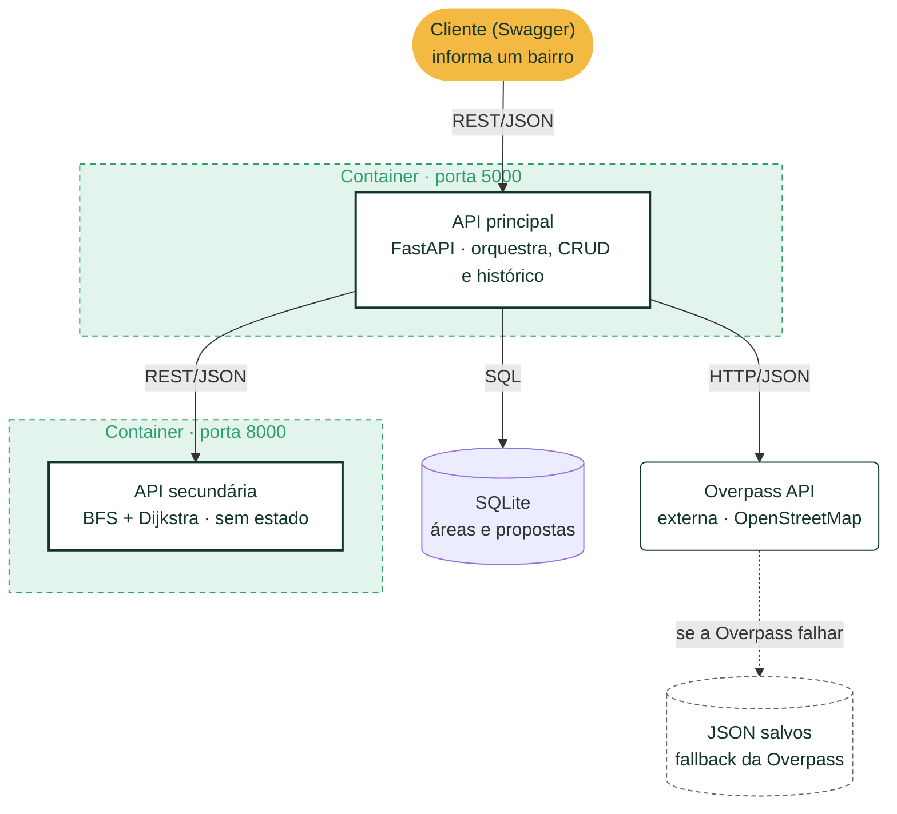

# Conecta Ciclovias — API principal

**Planejador de expansão de ciclovias no Rio de Janeiro.**

A malha de ciclovias de um bairro costuma ser formada por **ilhas desconectadas**: trechos soltos que não se ligam uns aos outros. Quem pedala sai da ciclovia e cai no trânsito.

O Conecta Ciclovias ajuda **planejadores urbanos da prefeitura e organizações de ciclistas** a decidir onde construir. Para cada bairro, o sistema encontra as ilhas e propõe os trechos de rua que, virando ciclovia, **conectam mais metros de ciclovia existente para cada metro construído**.

Esta é a API **principal**: ela recebe o bairro, busca as ruas e ciclovias no OpenStreetMap (Overpass API), pede a análise à [API secundária](https://github.com/GabrielCalixt/conecta_ciclovias_api_secundaria) e grava o histórico no SQLite.

---

## Arquitetura

**Fluxo do `POST /areas`:**

1. O cliente envia um bairro, por exemplo `{"bairro": "Botafogo"}`.
2. A principal monta a consulta Overpass QL do bairro e busca as ruas e ciclovias. Se a Overpass falhar, usa a resposta salva do bairro.
3. A principal traduz a resposta do OpenStreetMap para o formato de vias da secundária: `{id, tipo, nos, coordenadas}`.
4. A secundária monta o grafo, encontra as ilhas de ciclovia (**BFS**) e liga cada ilha à malha principal pelo menor trecho de rua (**Dijkstra**).
5. A principal grava a área e as propostas no SQLite e devolve o ranking.

| Componente | Responsabilidade | Tecnologia |
|---|---|---|
| API principal (este repositório) | Entrada do usuário, consulta à Overpass, CRUD e histórico | FastAPI, SQLAlchemy, httpx |
| [API secundária](https://github.com/GabrielCalixt/conecta_ciclovias_api_secundaria) | Regra de negócio: grafo, BFS, Dijkstra e ranking. Sem banco e sem rede | FastAPI, geopy |
| Overpass API | Fonte externa dos dados de ruas e ciclovias (OpenStreetMap) | Pública e gratuita |
| SQLite | Persistência das áreas e das propostas | Arquivo local (volume no Docker) |

As decisões e os limites de cada escolha estão em [TRADEOFFS.md](TRADEOFFS.md).

---

## Rotas

Documentação interativa (Swagger) em **http://localhost:5000/docs**.

| Método | Rota | Descrição |
|---|---|---|
| GET | `/saude` | Healthcheck. Devolve `{"status": "ok"}` |
| POST | `/areas` | Analisa um bairro e grava a área com as propostas. **201**; **404** se o bairro não tiver vias; **503** se a secundária (ou a Overpass sem dados salvos) estiver fora do ar |
| GET | `/areas` | Lista as áreas, da mais recente para a mais antiga. Filtro opcional `?bairro=` (parte do nome) |
| GET | `/areas/{id}/propostas` | Propostas da área. Filtro `?status=proposta\|aprovada\|descartada` e ordenação `?ordenar_por=razao` (maior primeiro, padrão) ou `metros_construir` (menor obra primeiro) |
| PUT | `/propostas/{id}` | Muda o status da proposta. Corpo: `{"status": "aprovada"}`. **422** para status inválido |
| DELETE | `/areas/{id}` | Remove a área e, em cascata, as propostas dela |

### Exemplo: `POST /areas`

Entrada:

```json
{"bairro": "Copacabana"}
```

Saída (resumida):

```json
{
  "id": 1,
  "bairro": "Copacabana",
  "criada_em": "2026-09-26T01:03:36.829778",
  "fonte_dados": "overpass",
  "total_vias": 407,
  "total_ilhas": 7,
  "metros_malha_principal": 5862.69,
  "propostas": [
    {"id": 1, "area_id": 1, "metros_ilha": 1647.97, "metros_construir": 1552.42,
     "razao": 1.06, "ilha_nos": [146377311, "..."], "caminho": [378673758, "..."],
     "status": "proposta"}
  ]
}
```

- **razao** = `metros_ilha / metros_construir`: quantos metros de ciclovia passam a ficar conectados para cada metro construído. Quanto maior, melhor o investimento.
- **fonte_dados** é `overpass` (dado ao vivo) ou `arquivo_local` (fallback).
- `ilha_nos` e `caminho` são IDs de nós do OpenStreetMap. Cada um pode ser consultado em `https://www.openstreetmap.org/node/<id>`.

---

## API externa: Overpass API (OpenStreetMap)

| Item | Detalhe |
|---|---|
| O que é | API de consulta de leitura aos dados do [OpenStreetMap](https://www.openstreetmap.org), o mapa colaborativo mundial |
| Instância usada | `https://overpass-api.de/api/interpreter` (configurável pela variável `OVERPASS_URL`) |
| Cadastro e chave | **Não exige** cadastro, conta nem chave de API |
| Custo | Gratuita |
| Licença dos dados | [ODbL (Open Database License)](https://opendatacommons.org/licenses/odbl/). Exige atribuição: **© OpenStreetMap contributors** ([copyright](https://www.openstreetmap.org/copyright)) |
| Política de uso | [Uso justo](https://dev.overpass-api.de/overpass-doc/en/preface/commons.html): poucas requisições por vez, timeout e identificação da aplicação |
| Documentação | [wiki.openstreetmap.org/wiki/Overpass_API](https://wiki.openstreetmap.org/wiki/Overpass_API) |

### Rota usada

`POST https://overpass-api.de/api/interpreter`, com a consulta no campo de formulário `data`. A resposta é JSON (`[out:json]`). Os dados são **consumidos e tratados dentro da aplicação**: o usuário nunca é redirecionado para a Overpass.

Consulta enviada para o bairro de Botafogo (`services/overpass.py`, função `montar_consulta`):

```
[out:json][timeout:120];
area["name"="Rio de Janeiro"]["admin_level"="8"]->.rio;
rel(area.rio)["boundary"="administrative"]["admin_level"="10"]["name"~"^Botafogo$",i];
map_to_area->.bairro;
way["highway"~"^(cycleway|primary|secondary|tertiary|residential|unclassified|living_street|service)$"](area.bairro);
out geom;
```

- `rel(area.rio)` garante que é o bairro do **Rio**. Existe Botafogo em Campinas, por exemplo.
- `admin_level=10` é o nível dos bairros do Rio no OpenStreetMap.
- Vêm **ciclovias e ruas comuns**. Sem as ruas, não haveria por onde ligar as ilhas.
- `out geom` devolve, para cada via, os IDs dos nós (`nodes`) e as coordenadas deles (`geometry`).

### Como a resposta é tratada

- Só os elementos `way` com `nodes` e `geometry` são usados.
- A via vira `"ciclovia"` quando `highway=cycleway`, ou quando `cycleway`, `cycleway:left`, `cycleway:right` ou `cycleway:both` vale `lane` (ciclofaixa) ou `track` (ciclovia segregada). Nos outros casos, vira `"rua"`.

### Uso justo e resiliência

- **User-Agent próprio** em todas as requisições, identificando a aplicação.
- **Timeout de 30 s** na API (`OVERPASS_TIMEOUT`) e `[timeout:120]` na consulta.
- **Intervalo de 10 s** entre bairros no script de download, com nova tentativa após 30, 60 e 90 s quando a Overpass responde 429 ou 504.
- **Fallback:** se a Overpass falhar (erro de rede, timeout, 429, 504 ou erro no campo `remark`), a API usa a resposta salva em `dados/overpass/<bairro>.json` e grava `fonte_dados = "arquivo_local"`.
- O nome do bairro é **validado** (só letras, espaços, hífen e apóstrofo) antes de entrar na consulta, para evitar injeção de Overpass QL.

### Dados salvos (Zona Sul)

Respostas reais da Overpass para os 18 bairros da Zona Sul ficam em `dados/overpass/`. Elas servem de fallback, de dados reais para os testes e de demonstração. Para baixar de novo:

```bash
python -m scripts.baixar_zona_sul            # só os que faltam
python -m scripts.baixar_zona_sul --forcar   # todos
python -m scripts.baixar_zona_sul Urca Leme  # só estes
```

Resultado da análise sobre os arquivos salvos (setembro de 2026):

| Bairro | Vias | Vias de ciclovia | Ilhas | Malha principal (m) | Propostas | Melhor razão |
|---|---:|---:|---:|---:|---:|---:|
| Leme | 62 | 3 | 1 | 1.089 | 0 | — |
| Copacabana | 407 | 32 | 7 | 5.863 | 4 | 1,06 |
| Ipanema | 211 | 20 | 6 | 4.036 | 0 | — |
| Leblon | 322 | 14 | 5 | 3.377 | 4 | 0,65 |
| Lagoa | 369 | 16 | 12 | 1.195 | 2 | 0,27 |
| Jardim Botânico | 244 | 1 | 1 | 1.195 | 0 | — |
| Gávea | 269 | 12 | 3 | 1.106 | 2 | 0,63 |
| Humaitá | 133 | 7 | 3 | 1.538 | 2 | 37,22 |
| Botafogo | 962 | 48 | 9 | 2.677 | 8 | 93,09 |
| Urca | 167 | 6 | 3 | 1.151 | 1 | 1,53 |
| Flamengo | 181 | 13 | 3 | 3.960 | 0 | — |
| Laranjeiras | 402 | 44 | 4 | 1.931 | 3 | 175,32 |
| Cosme Velho | 98 | 0 | 0 | — | 0 | — |
| Catete | 125 | 21 | 3 | 1.106 | 2 | 4,84 |
| Glória | 196 | 30 | 10 | 4.338 | 0 | — |
| São Conrado | 244 | 7 | 1 | 4.312 | 0 | — |
| Vidigal | 50 | 2 | 1 | 3.814 | 0 | — |
| Rocinha | 63 | 2 | 1 | 1.087 | 0 | — |

- **Razões muito altas são lacunas de poucos metros.** Em Laranjeiras, 3,4 m de obra conectam 600 m de ciclovia. Em Botafogo, 14 m conectam 1,3 km. Normalmente é uma travessia de rua que falta na malha.
- **Ipanema, Flamengo e Glória têm ilhas, mas nenhuma proposta.** A malha principal delas (a orla e o Aterro) é uma ciclovia segregada que não compartilha nenhum nó com as ruas da consulta: no OSM, ela se liga às ruas por faixas de pedestre e calçadas (`footway`/`path`), que a consulta não traz. Detalhes em [TRADEOFFS.md](TRADEOFFS.md).

---

## Instalação e execução local

Pré-requisito: Python 3.14. A API secundária precisa estar rodando na porta 8000 (veja o [README dela](https://github.com/GabrielCalixt/conecta_ciclovias_api_secundaria)).

```bash
git clone https://github.com/GabrielCalixt/conecta_ciclovias_api_principal.git
cd conecta_ciclovias_api_principal

python -m venv .venv
# Windows (PowerShell)
.venv\Scripts\Activate.ps1
# Linux/Mac
source .venv/bin/activate

pip install -r requirements.txt
uvicorn app:app --reload --port 5000
```

Acesse **http://localhost:5000/docs**. O banco SQLite é criado automaticamente em `db/conecta_ciclovias.sqlite3`.

### Variáveis de ambiente (opcionais)

| Variável | Padrão | Para quê |
|---|---|---|
| `SECUNDARIA_URL` | `http://localhost:8000` | Endereço da API secundária |
| `OVERPASS_URL` | `https://overpass-api.de/api/interpreter` | Instância da Overpass |
| `OVERPASS_TIMEOUT` | `30` | Segundos de espera pela Overpass antes do fallback |
| `DATABASE_URL` | `sqlite:///db/conecta_ciclovias.sqlite3` | Banco de dados (SQLAlchemy) |

### Testes e lint

```bash
pytest          # testes (a Overpass e a secundária são simuladas; não precisa de internet)
ruff check .    # lint
ruff format .   # formatação
```

No Windows, o script `verificar.ps1` roda tudo em sequência e para no primeiro erro:

```powershell
.\verificar.ps1
```

---

## Execução com Docker (um container para cada API)

Pré-requisito: [Docker](https://docs.docker.com/get-docker/) instalado e em execução.

Cada API roda no **seu próprio container**. Os dois containers entram numa **rede Docker** chamada `conecta_ciclovias`, e a principal encontra a secundária pelo **nome do container** (`secundaria`).

**1. Suba a API secundária primeiro**, seguindo o [README dela](https://github.com/GabrielCalixt/conecta_ciclovias_api_secundaria#execução-com-docker). Em resumo, na pasta da secundária:

```bash
docker network create conecta_ciclovias
docker build -t conecta-ciclovias-secundaria .
docker run -d --rm --name secundaria --network conecta_ciclovias -p 8000:8000 conecta-ciclovias-secundaria
```

**2. Suba a API principal**, na pasta deste repositório:

```bash
docker build -t conecta-ciclovias-principal .
docker run -d --rm --name principal --network conecta_ciclovias -p 5000:5000 -v banco_principal:/app/db conecta-ciclovias-principal
```

- Principal: **http://localhost:5000/docs**
- Secundária: **http://localhost:8000/docs**

O que cada opção faz:

| Opção | Para quê |
|---|---|
| `--network conecta_ciclovias` | Coloca o container na mesma rede da secundária |
| `--name principal` / `--name secundaria` | Nome do container. A principal chama a secundária em `http://secundaria:8000`, que é o valor de `SECUNDARIA_URL` definido no `Dockerfile` |
| `-p 5000:5000` | Liga a porta 5000 do seu computador à porta 5000 do container |
| `-v banco_principal:/app/db` | Guarda o banco SQLite num volume. Sem ele, o banco some quando o container para |
| `-d` / `--rm` | Roda em segundo plano / remove o container quando ele for parado |

**Comandos úteis:**

```bash
docker ps                          # containers rodando
docker logs -f principal           # logs da principal (Ctrl+C para sair)
docker stop principal secundaria   # para os dois
docker volume rm banco_principal   # apaga o banco (com os containers parados)
```

- Se `docker network create` avisar que a rede **já existe**, é só seguir para o próximo comando.
- Por que não apontar a principal para `localhost:8000`? Dentro do container, `localhost` é o **próprio container**, e não o seu computador. Na rede Docker, os containers se enxergam pelo nome.
- Para rodar a principal num container e a secundária **fora** do Docker (com uvicorn), troque o endereço: `-e SECUNDARIA_URL=http://host.docker.internal:8000` (Docker Desktop no Windows e no Mac).

---

## Estrutura de pastas

```
app.py              # rotas FastAPI e orquestração
database.py         # engine SQLite, sessão e dependência get_db
logger.py           # configuração de log
models/             # tabelas SQLAlchemy: Area e Proposta
schemas/            # formatos de entrada e saída (Pydantic)
services/
  overpass.py       # consulta à Overpass, conversão para vias e fallback
  secundaria.py     # cliente da API secundária
scripts/
  baixar_zona_sul.py  # baixa e salva as respostas da Overpass
dados/overpass/     # respostas reais da Overpass (fallback e testes)
tests/              # testes de conversão, banco e rotas (pytest)
Dockerfile
```

---

## Tecnologias

- [FastAPI](https://fastapi.tiangolo.com/): API REST e Swagger automático
- [SQLAlchemy](https://www.sqlalchemy.org/) + SQLite: persistência
- [httpx](https://www.python-httpx.org/): chamadas à Overpass e à API secundária
- [Pydantic](https://docs.pydantic.dev/): validação de entrada e saída
- [pytest](https://docs.pytest.org/) e [ruff](https://docs.astral.sh/ruff/): testes e lint

Dados de vias © [OpenStreetMap contributors](https://www.openstreetmap.org/copyright), sob licença ODbL.

Projeto desenvolvido para o MVP da disciplina de Arquitetura de Software, na pós-graduação em Engenharia de Software da PUC-Rio.
